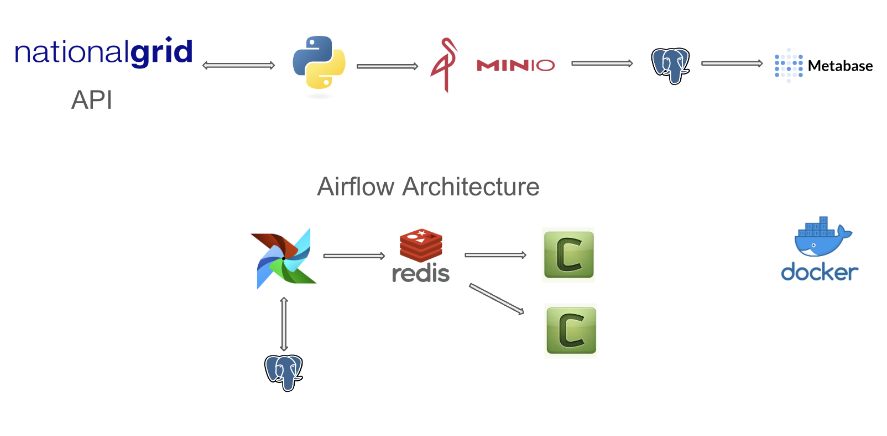
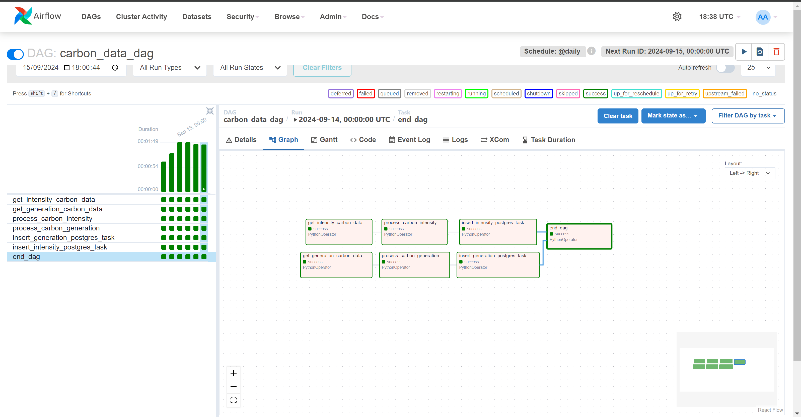
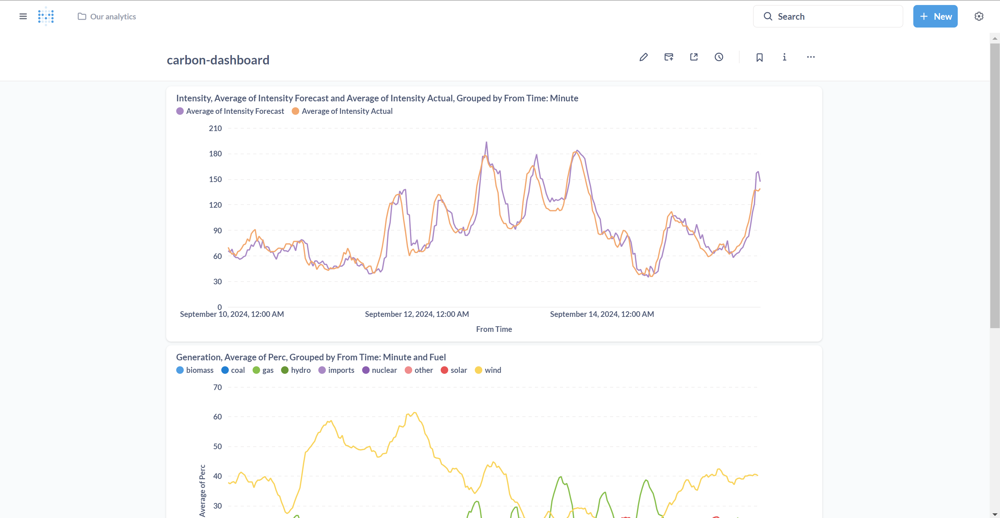
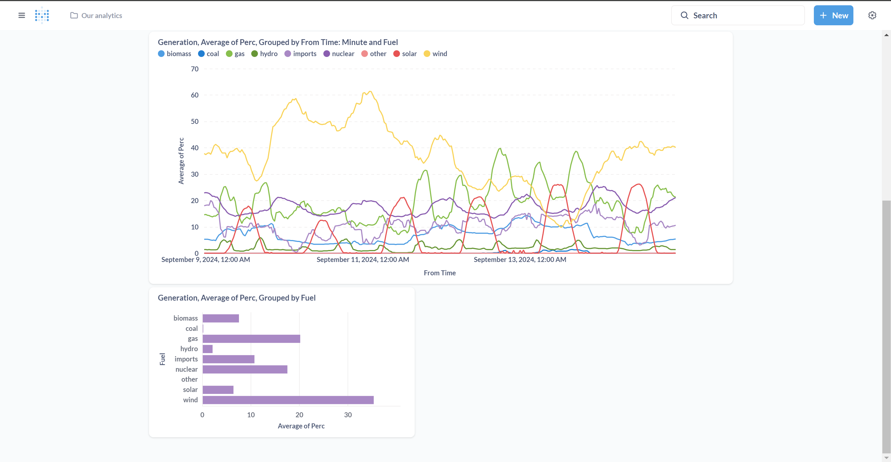
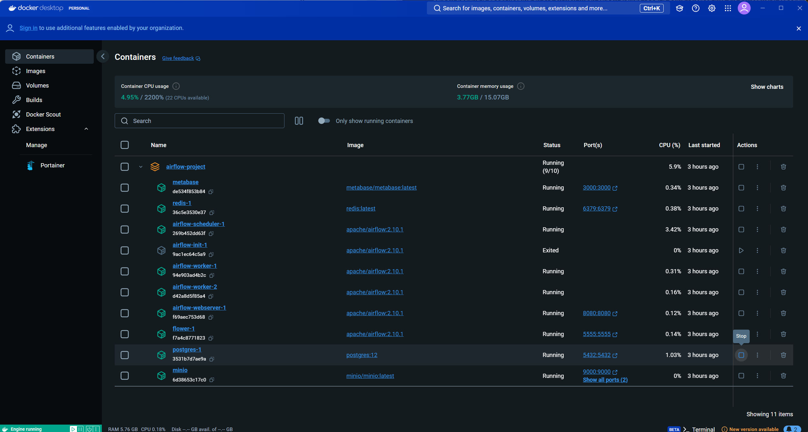
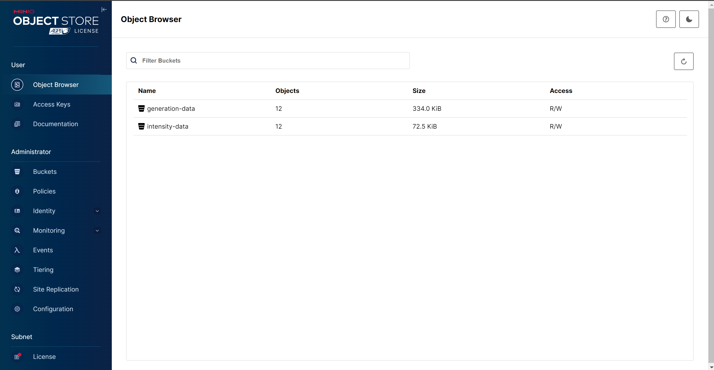
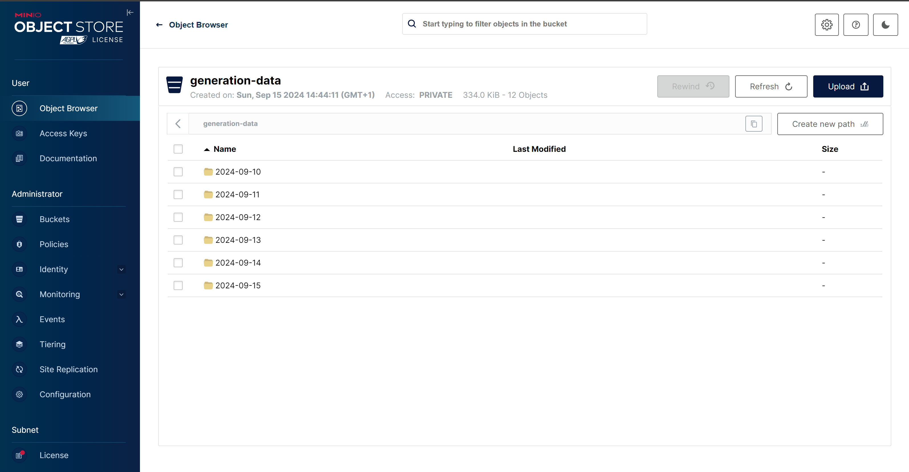
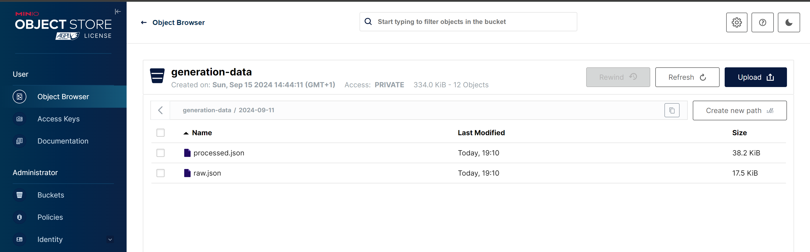

# Carbon-Tracker-Airflow

This is an ETL pipeline project for processing and visualizing carbon intensity and generation data.

Carbon tracking is about keeping an eye on how much carbon dioxide (CO2) is being released into the atmosphere, especially when it comes to generating electricity. 

Carbon intensity tells us how much CO2 is produced for every unit of energy we use, while carbon generation shows us where our energy is coming from—whether it's from renewable sources like wind or solar, or fossil fuels like coal and gas. 

By tracking both, we can get a clearer picture of how clean or dirty our energy is and work towards reducing emissions.

- **ETL Orchestration**: Managed with Apache Airflow.
- **Data Visualization**: Created with Metabase.
- **Containerized**: Entire project runs in Docker for easy setup and deployment.

# Example Business Problem
Businesses are increasingly required to reduce their carbon footprint due to corporate sustainability goals, regulatory pressures, and consumer demand for environmentally responsible practices. However, many businesses, especially those with energy-intensive operations (e.g., manufacturing plants, data centers), lack visibility into when the electricity they use is generated from renewable or low-carbon sources. As a result, they miss opportunities to align their energy consumption with periods of cleaner energy availability, leading to higher emissions.

# Solution
This project delivers a daily dashboard that provides insights into the previous day's carbon intensity and energy generation mix. The system fetches, processes, and reports on the carbon intensity of the electricity grid, enabling businesses to:

- Optimize operations to run during periods when carbon intensity is low.
- Reduce their carbon emissions by aligning energy-intensive activities with cleaner energy availability.
- Report on sustainability performance and progress toward emission reduction goals.

## Setup

1. Setup `.env` using  `.template.env`.
2. Run `docker-compose -f docker-compose.yml up --build -d --remove-orphans`
3. Run `docker compose -f docker-compose.yml down` to bring down the containers when done.

## Components
- **Airflow**: Orchestrates the ETL process.
- **MinIO**: Stores raw and processed data. AWS S3.
- **PostgreSQL**: Stores processed data.
- **Metabase**: Visualizes carbon data.
- **Celery**: Executes asynchronous and distributed tasks.
- **Redis**: Message broker for Celery.
- **Flower**: Web-based tool for monitoring Celery workers.

## Screenshots

### Airflow

## Metabase

## Docker

## Minio(AWS S3)

